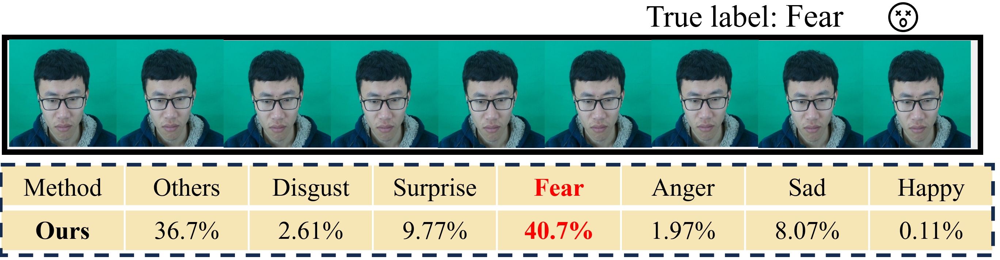
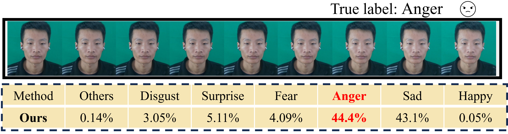

# HSTA_MER
Hierarchical Space-Time Attention for Micro-Expression Recognition in PyTorch


The codebase is mainly built with following libraries:
you can refer here (https://github.com/OceanSummerDay/HSTA_MER/tree/main/hsta_model_core/example) for more Estimated results.

PyTorch and torchvision.
We can successfully reproduce the main results under two settings below:

Tesla A100 (80G): CUDA 11.1 + PyTorch 1.8.0 + torchvision 0.9.0


timm==0.4.8/0.4.12

deepspeed==0.5.8


TensorboardX

decord

einops

Note:
We recommend you to use PyTorch >= 1.8.0.


The implementation of our HSTA .

-  For example, to **fine-tune cross_uni_hsta_base_224** with a Tesla A100 (80G), on casme3 in 5-folds you can run

  ```bash
script_name=$(basename "$0")
device_num="0"
batch_size=32
lr=0.0005
# args.lr = args.lr * total_batch_size / 256
epochs=150
k_folds=5
OUTPUT_DIR="YOUR PATH"
# path to pretrain model
MODEL_PATH='YOUR PATH opt'
DATA_PATH='YOUR PATH'
cd YOUR PATH
nohup python K_folds_finetuning.py \
--use_extra_macro_data \
--hsta_num 4 \
--depth_choice_num 2 \
--model cross_uni_hsta_base_224 \
--num_frames 6 \
--fill_by_zeros_or_img img \
--no_save_ckpt \
--use_emothion_or_objective_class_as_label objective_class \
--use_weight_loss False \
--data_set casme3 \
--nb_classes 7 \
--data_path ${DATA_PATH} \
--log_dir ${OUTPUT_DIR} \
--k_folds ${k_folds} \
--output_dir ${OUTPUT_DIR} \
--batch_size ${batch_size} \
--device_num ${device_num} \
--input_size 224 \
--short_side_size 224 \
--save_ckpt_freq 200 \
--sampling_rate 4 \
--opt adamw \
--lr ${lr} \
--val_freq 1 \
--opt_betas 0.9 0.999 \
--weight_decay 0.05 \
--sh_name ${script_name} \
--epochs ${epochs} \
--prefetch_generator \
--fc_drop_rate 0.2 \
--drop 0.2 \
--drop_path 0.2 \
--layer_decay 0.90 \
--no_noise \
--model_header_mode 2 >> "YOUR PATH"${script_name}.txt 2>&1 &

  ```


### Note:

- Here we show the 5-fold cross-validation method, script and code on casme3. For other data sets and LOSO, you can refer to this link (https://github.com/davidnvq/me_recognition)  to modify the train function implementation.
- The path in the code needs to be modified to the path of your local file.
- Here total batch size = (`batch_size` per gpu) x `nodes` x (gpus per node).
- `lr` here is the base learning rate. The ` actual lr` is computed by the [linear scaling rule](https://arxiv.org/abs/1706.02677): `` actual lr`` = `lr` * total batch size / 256.
- When performing LOSO cross-validation, it is recommended to run multiple cards in parallel, use one script to start the execution of other scripts, and finally merge all results.
